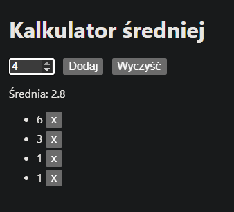

# Kalkulator średniej (JavaScript)

Prosta apk do obliczania średniej z ocen 1–6.

## Funkcje

- Dodawanie ocen 1–6 z walidacją
- Usuwanie konkretnych ocen za pomocą przycisku "x".
- Czyszczenie wszystkich danych
- Automatyczne zapisywanie ocen w localStorage

## Uruchomienie

Otwórz plik `index.html` w przeglądarce  
lub wejdź na [GitHub Pages](https://Zehvems.github.io/avg-calculator/).

## Zrzut ekranu

